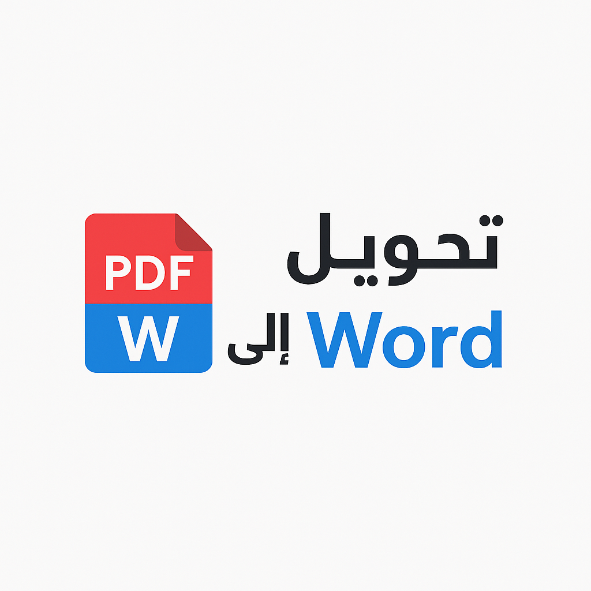

# أداة تحويل PDF إلى Word

**pdf2word-fast.vercel.app**  
تحويل ملفات PDF إلى مستندات Word (DOCX) بسهولة وبشكل مجاني، بدون الحاجة إلى تسجيل أو تحميل برامج.

## الميزات

- تحويل فوري من PDF إلى Word
- يدعم اللغة العربية والإنجليزية تلقائيًا حسب متصفح الزائر
- تصميم بسيط وسريع الاستجابة (Responsive)
- يدعم جميع الأجهزة (هاتف، كمبيوتر، تابلت)
- مجاني بالكامل

## كيفية الاستخدام

1. قم برفع ملف PDF من جهازك.
2. اضغط على زر **ابدأ التحويل**.
3. سيتم تحويل الملف مباشرة ويمكنك تحميله بصيغة Word (DOCX).

## صورة الشعار

## المعاينة الحية

[افتح الموقع الآن](https://pdf2word-fast.vercel.app)

## ملاحظة تقنية

يستخدم الموقع API من خدمة [PDF.co](https://pdf.co) لتحويل الملفات، ويمكن استبدال `YOUR_API_KEY` في كود JavaScript بمفتاحك الخاص عند نشر النسخة النهائية.

---

**© 2024 | جميع الحقوق محفوظة**
